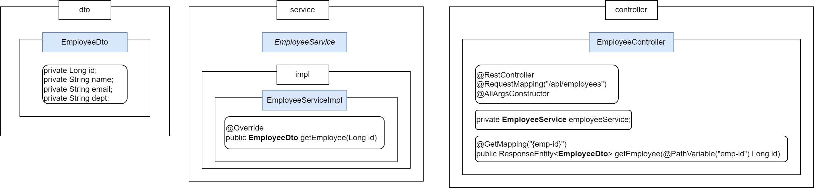
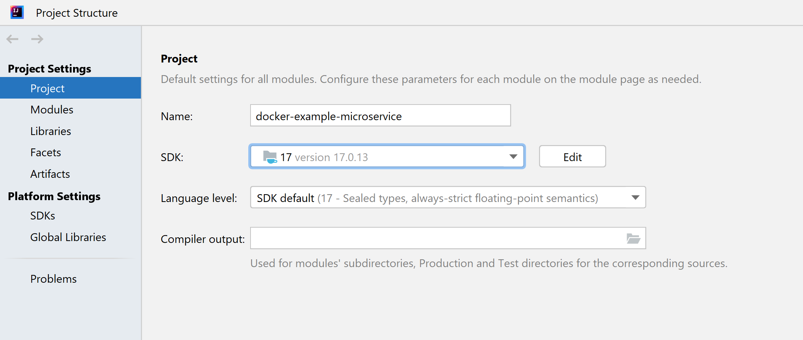
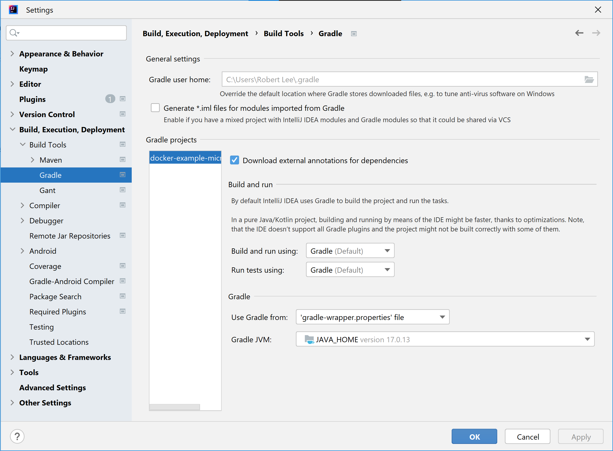
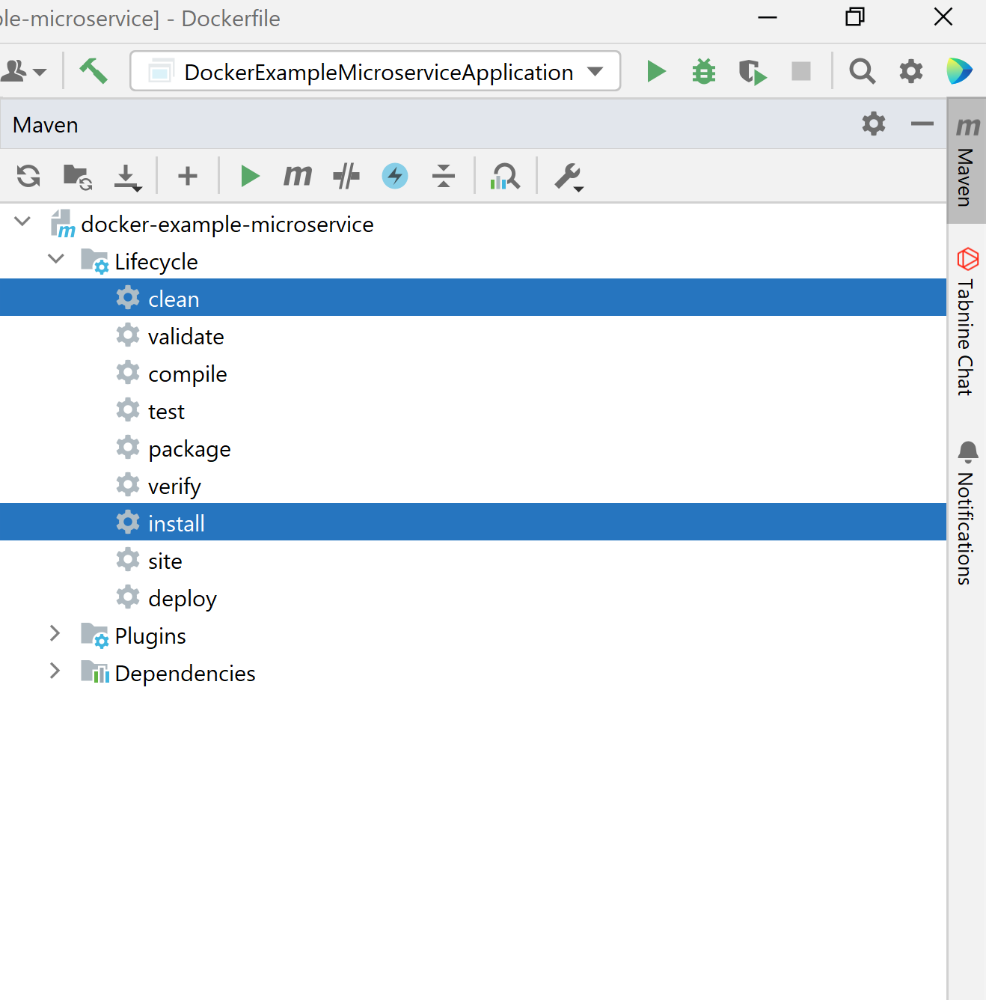
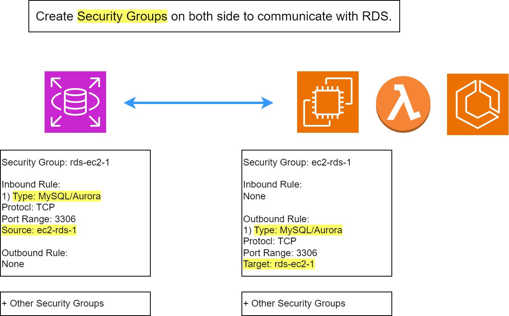

# ecs-spring-boot



## 1) Create a Spring Boot application
1. Download JDK
https://www.openlogic.com/openjdk-downloads

2. Edit the system environment variables
System variables
JAVA_HOME: C:\Program Files\OpenLogic\jdk-17.0.13.11-hotspot
PATH: %JAVA_HOME%\bin

* Run java -version in CMD to check the actual current version of JDK 
* Check if there are directories to previous versions of jdk in PATH and delete them




In case of Gradle


Creating a JAR file using Maven



Dockerfile
```bash
FROM openjdk:17-alpine
WORKDIR app
COPY target/docker-example-microservice-0.0.1-SNAPSHOT.jar ./docker-example.jar 
ENTRYPOINT ["java","-jar","/app/docker-example.jar"]
```

## ECR
IAM user with AmazonEC2ContainerRegistryFullAccess or else.
aws configure

Run ECR push commands

ECS
# Task - Container port
# Target Group - 80
# ALB - 80

Cluster: name
Task family: name, container name, container image uri, container port, app protocol (HTTP, HTTP, GRC, None)
Service: name, desired task number, vpc, subnet, security group, ALB, Auto scaling

Target group: 
ALB: 

+ ecs task role IAM

ALB log -> S3 policy 
```bash
{
  "Version": "2012-10-17",
  "Statement": [
    {
      "Effect": "Allow",
      "Principal": {
        "AWS": "arn:aws:iam::elb-account-id:root"
      },
      "Action": "s3:PutObject",
      "Resource": "s3-bucket-arn"
    }
  ]
}
```
elb-account-id
us-east-1	127311923021
us-east-2	033677994240
us-west-1	027434742980
us-west-2	797873946194

ecs
public instance + public ip enabled + public ALB
priate insance + public ip disabled + manually create target group and public ALB


# RDS
RDS - EC2 / Lambda / ECS container


### Secret Manager
1) Make Role with SecretManagerReadWrite or custom policy getSecret -> Give role to task role and task execution role
2) ValueFrom Secret ARN:key::

!!!
Mixed Content: The page at 'https://a.dongwonlee.dev/' was loaded over HTTPS, but requested an insecure resource 'http://backend2.devcluster1:3001/api/email'. This request has been blocked; the content must be served over HTTPS.
backend API server endpoint should be https
make each other security group Inbound / Outbound


Local MySQL connection - Use separate host and port
```bash
    const dbConfig = {
      host: "localhost",
      port: 3306,
      user: "root",
      database: "items",
    };
```

# ECS communication between Services
Use Service Connect
!!! Task Definition - Port Mapping Name - Manually Input, do not auto create

!!! Use Chrome developer tools to get more information if there is a problem
Mixed Content: browser does not accept http response when https request is sent -> Nextjs use proxy api: frontend first send request to its backend and then send it to official backend
