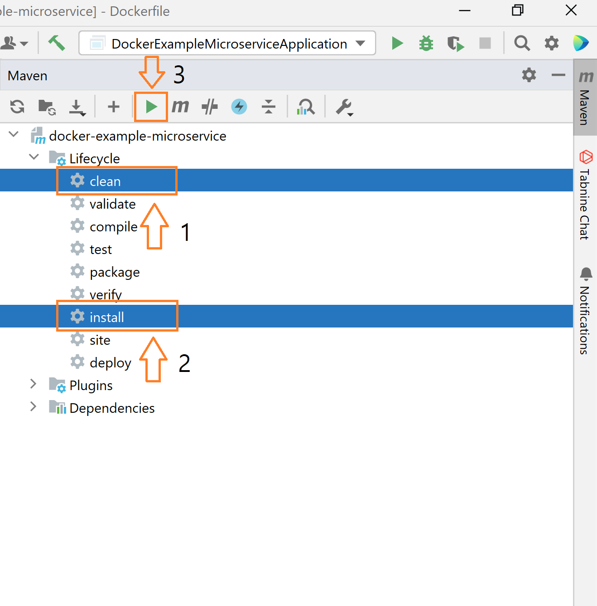

# ecs-spring-boot


## 1) Create a Spring Boot application
1. Download JDK
https://www.openlogic.com/openjdk-downloads

2. Edit the system environment variables
System variables
JAVA_HOME: C:\Program Files\OpenLogic\jdk-17.0.13.11-hotspot
PATH: %JAVA_HOME%\bin

* Run java -version in CMD to check the actual current version of JDK 
* Check if there are directories to previous versions of jdk in PATH and delete them


In case of Gradle


Creating a JAR file using Maven



Dockerfile
```bash
FROM openjdk:17-alpine
WORKDIR app
COPY target/docker-example-microservice-0.0.1-SNAPSHOT.jar ./docker-example.jar 
ENTRYPOINT ["java","-jar","/app/docker-example.jar"]
```

### Load Balancer, Target Group, and Domain
1. ACM create -> get CNAME and Value
2. Domain DNS management create CNAME record
3. Check ACM validated
4. Set Load Balancer the SSL certificate

1. Registered Domain - CNAME record main domain or subdomain (*) - Load Balancer DNS
2. Add Listener 443 with SSL certificate
3. Listener 80 - Redirect URL to Listener 443
4. Listener 443 - Add Listener Rule with Host Header condition
* Check ECS Service Security Group - Inbound Port 3000 for ALB Health check

### Website access Typo Error
Check Route 53 CNAME record TTL 
Load Balancer Host header condition listener rule change takes time according to DNS record TTL

### Too many redirections
Nginx HTTP to HTTPS configuration 
```bash
sudo ls /etc/nginx/sites-enabled/
cat /etc/nginx/sites-enabled/local  # Also check other files
```

## ECR
IAM user with AmazonEC2ContainerRegistryFullAccess or else.
aws configure

Run ECR push commands

ECS
# Task - Container port
# Target Group - 80
# ALB - 80

Cluster: name
Task family: name, container name, container image uri, container port, app protocol (HTTP, HTTP, GRC, None)
Service: name, desired task number, vpc, subnet, security group, ALB, Auto scaling

Target group: 
ALB: 

+ ecs task role IAM

ALB log -> S3 policy 
```bash
{
  "Version": "2012-10-17",
  "Statement": [
    {
      "Effect": "Allow",
      "Principal": {
        "AWS": "arn:aws:iam::elb-account-id:root"
      },
      "Action": "s3:PutObject",
      "Resource": "s3-bucket-arn"
    }
  ]
}
```
elb-account-id
us-east-1	127311923021
us-east-2	033677994240
us-west-1	027434742980
us-west-2	797873946194

ecs
public instance + public ip enabled + public ALB
priate insance + public ip disabled + manually create target group and public ALB


# RDS
RDS - EC2 / Lambda / ECS container


### Parameter Store
1) Make Role with TaskExecutionPolicy + AmazonSSMReadOnlyAccess + custom policy getSecret -> Give Role to [Task execution role]
```json
{
  "Version": "2012-10-17",
  "Statement": [
    {
      "Effect": "Allow",
      "Action": [
        "ssm:GetParameters",
        "ssm:GetParameter",
        "ssm:DescribeParameters"
      ],
      "Resource": "arn:aws:ssm:region:account-id:parameter/myapp/*"
    },
    {
      "Effect": "Allow",
      "Action": "kms:Decrypt",
      "Resource": "arn:aws:kms:region:account-id:key/key-id"
    }
  ]
}
```
2) ValueFrom Secret ARN:key::
3) (If using Customer Manager Key) KMS Policy: Add the ECS task role to the resource policy of the KMS key

### Secret Manager
1) Make Role with TaskExecutionPolicy + SecretManagerReadWrite or custom policy getSecret -> Give Role to [Task execution role]
2) ValueFrom Secret ARN:key::

!!!
Mixed Content: The page at 'https://a.dongwonlee.dev/' was loaded over HTTPS, but requested an insecure resource 'http://backend2.devcluster1:3001/api/email'. This request has been blocked; the content must be served over HTTPS.
backend API server endpoint should be https
make each other security group Inbound / Outbound


Local MySQL connection - Use separate host and port
```bash
    const dbConfig = {
      host: "localhost",
      port: 3306,
      user: "root",
      database: "items",
    };
```

EC2 - SecretManager
1. Add IAM Role with getSecret Policy
2. Check script on Secret Manger Secret for getting the secret
3. EC2: sudo apt install mysql-client / sudo apt install python3 / sudo apt install python3-boto3 / sudo apt install python3-pymysql / use script to use secret 
```python
import os
import boto3
import json
import subprocess

def get_secret():
    secret_name = <Secret Name>
    region_name = <Region>

    session = boto3.session.Session()
    client = session.client(
        service_name="secretsmanager",
        region_name=region_name
    )

    response = client.get_secret_value(SecretId=secret_name)
    secret = json.loads(response["SecretString"])
    return secret["password"]

def connect_to_mysql():
    password = get_secret()
    os.environ["MYSQL_PWD"] = password  
    command = [
        "mysql",
        "-h", <RDS instance endpoint>,
        "-u", <RDS instance user name>
    ]
    subprocess.run(command)

if __name__ == "__main__":
    connect_to_mysql()
```

# SSM -> Fargate
1. (If using local PC) Install Session Manager Plugin
https://docs.aws.amazon.com/systems-manager/latest/userguide/install-plugin-windows.html
2. Add AmazonSSMManagedInstanceCore to ECS Task Role (Not ECS Task Execution Role)
3. Enable execute command in service
```bash
aws ecs update-service --cluster Devcluster --service backend-service --enable-execute-command --force-new-deployment
```
4. Execute command
```bash
aws ecs execute-command --region us-east-1 --cluster DevCluster --task [Serivce's Task ARN] --container [Task Definition Name] --command "/bin/sh" --interactive
```
# Error Troubleshooting
### Use Chrome Developer Tools

# Mixed Content Error - Browser not accepting http
### Nextjs - Use its own proxy server
/pages/api/proxy.js
```bash
import axios from 'axios';

export default async function handler(req, res) {
  const backendUrl = 'http://backend-service.local/api'; // HTTP 백엔드 엔드포인트

  try {
    const response = await axios({
      method: req.method, 
      url: `${backendUrl}${req.url}`, 
      data: req.body,
      headers: req.headers,
    });

    res.status(response.status).json(response.data);
  } catch (error) {
    console.error('Proxy error:', error.message);
    res.status(error.response?.status || 500).json({
      message: 'Error proxying request to backend',
      error: error.message,
    });
  }
}
```
### Others - Use Nginx proxy with SSL, Certbot as Let's Encrypt
```bash
server {
    listen 443 ssl;
    server_name frontend.example.com;

    ssl_certificate /path/to/fullchain.pem;
    ssl_certificate_key /path/to/privkey.pem;

    location /api {
        proxy_pass http://backend-service.local;
        proxy_set_header Host $host;
        proxy_set_header X-Real-IP $remote_addr;
    }

    location / {
        root /var/www/frontend;
        index index.html;
        try_files $uri /index.html;
    }
}
```
90 days renew
```bash
sudo certbot renew --dry-run
sudo systemctl reload nginx
```

Practical implementation: Separate containers and Certbot
Issue and renew certificates with the Certbot container.

Share the certificate path with the Nginx container:

Store the certificate in the /etc/letsencrypt directory and share it with Nginx.
Example Nginx configuration file:
```bash
server {
    listen 443 ssl;
    server_name example.com;

    ssl_certificate /etc/letsencrypt/live/example.com/fullchain.pem;
    ssl_certificate_key /etc/letsencrypt/live/example.com/privkey.pem;

    location / {
        root /usr/share/nginx/html;
        index index.html;
        try_files $uri /index.html;
    }
}

server {
    listen 80;
    server_name example.com;

    location /.well-known/acme-challenge/ {
        root /var/www/certbot;
    }

    return 301 https://$host$request_uri;
}
```

Recommended Workflow
Issue certificates with the Certbot container.
Share the certificates with Nginx (using the /etc/letsencrypt volume).
Run the Certbot container periodically from cron or systemd for automatic renewal.

### Solution 
Certbot uses HTTP-01 or DNS-01 validation to verify domain ownership. In a distributed container environment, you should run Certbot in one container to issue certificates and share it with other containers.
1) Method: Run the Certbot container separately
2) Method: Use DNS-01 Verification
Configuration
DNS-01 verification verifies domain ownership by adding a specific TXT record to the DNS records of the domain name.
Using DNS-01 verification instead of HTTP-01 will work even if your Certbot run environment is distributed.
Pros
No dependency on HTTP paths in distributed environments.
Easy to manage through your domain DNS provider.

# Nginx /etc/nginx
1) conf.d
2) sites-available -> sites-enabled: sudo ln -s /etc/nginx/sites-available/default /etc/nginx/sites-enabled/

# Nginx Certbot
```bash
apt update
apt install certbot python3-certbot-nginx vim -y

certbot --nginx -d example.com

vi /etc/nginx/nginx.conf
    #include /etc/nginx/conf.d/*.conf;
    include /etc/nginx/sites-enabled/*;

cd /etc/nginx
mkdir sites-available
mkdir sites-enabled

vi /etc/nginx/sites-available/example.com
ln -s /etc/nginx/sites-available/example.com /etc/nginx/sites-enabled/

certbot install --cert-name example.com --nginx

nginx -t
nginx -s reload
```

Change Nginx to use sites-enabled
Open the main Nginx configuration file:

Check the include directive in /etc/nginx/nginx.conf.
bash
Copy code
sudo nano /etc/nginx/nginx.conf
Add include for sites-enabled directory:

Comment or delete existing include /etc/nginx/conf.d/*.conf;
Add include /etc/nginx/sites-enabled/*;
nginx
Copy code
http {
// Remove include for existing conf.d directory
// include /etc/nginx/conf.d/*.conf;

// Include new sites-enabled directory
include /etc/nginx/sites-enabled/*;

}
Test the configuration file:

bash
Copy code
sudo nginx -t
Restart Nginx service:

bash
Copy code
sudo systemctl reload nginx

# Too many redirections
[Target group] check port 80 
ALB 443 -> target group port 80 -> nginx redirect 443 -> ALB 443 -> target group 80


# ECS communication between Services
Use Service Connect
!!! Task Definition - Port Mapping Name - Manually Input, do not auto create

!!! Use Chrome developer tools to get more information if there is a problem
Mixed Content: browser does not accept http response when https request is sent -> Nextjs use proxy api: frontend first send request to its backend and then send it to official backend

# CICD
Dockerfile, buildspec.yaml, appspec.yaml in project folder

### CodeBuild - permission + AmazonEC2ContainerRegistryReadOnly
